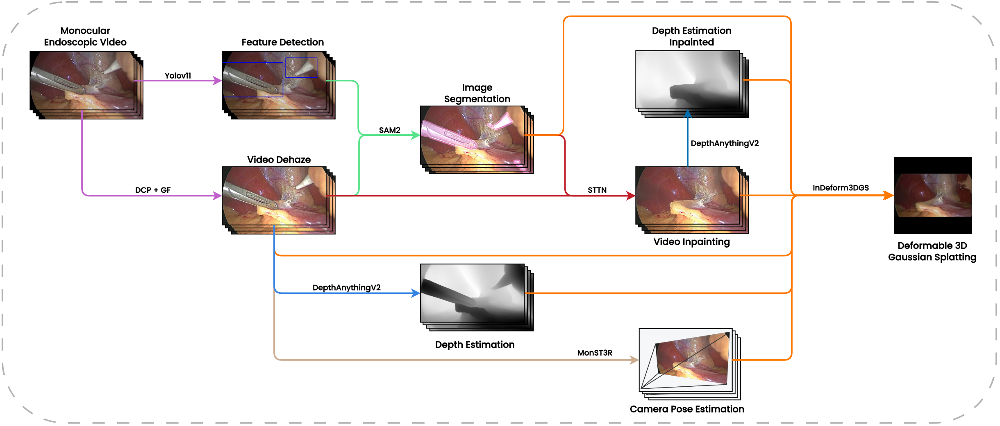
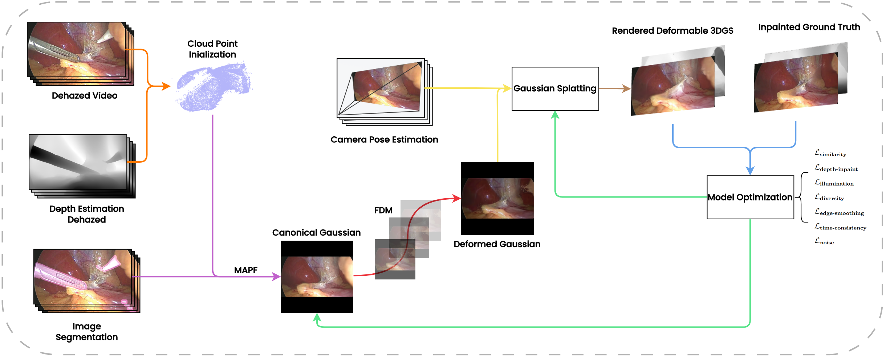
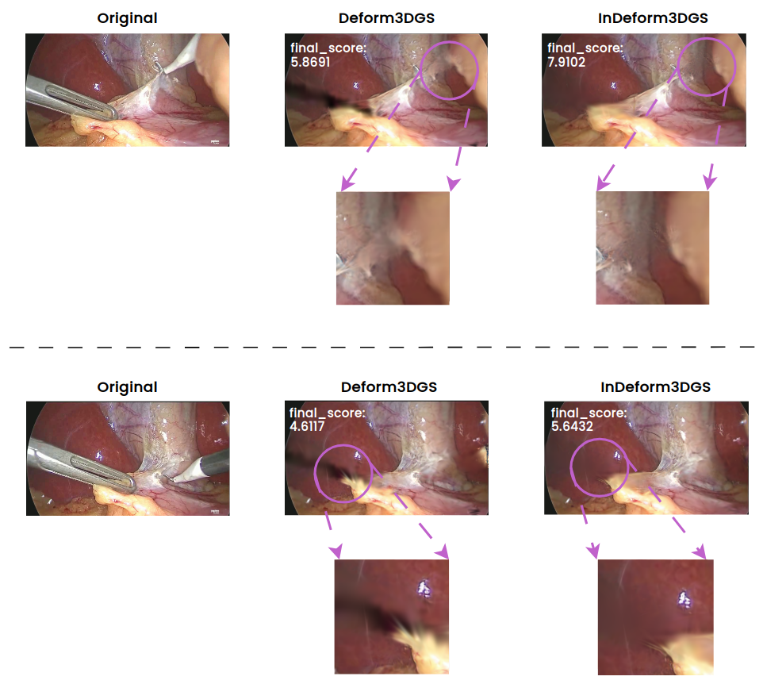

# InDeform3DGS Project

## **System Overview**
The **InDeform3DGS project** is a **comprehensive processing pipeline** that **covers** the entire process from the **creation of a structured dataset** from **raw RGB endoscopic surgical videos** to the **3D reconstruction** using the proposed **InDeform3DGS method**. This method is specifically designed to handle the challenges of **surgical tool occlusions** and the **dynamic and deformable nature** of the surgical environment.  

The system includes multiple **computer vision** and **deep learning** modules that process the input video **to create the structured dataset**, which is subsequently used for **3D reconstruction**.

### **Pipeline Stages**
1. **Raw Video Input**: The system takes an unprocessed **RGB video** as input.
2. **Dehazing Module**: Enhances visibility in hazy or low-contrast scenes.
3. **Detection & Segmentation**:
   - **YOLO-based surgical tool detection**.
   - **SAM2 segmentation** to generate tool masks.
4. **Video Inpainting**:
   - **STTN-based inpainting** removes surgical tools from the frames.
5. **Depth Estimation**:
   - **DepthAnything V2** predicts per-frame depth maps.
6. **Camera Pose Estimation**:
   - **MonST3R-based pose estimation** determines the **camera trajectory**.
7. **3D Gaussian Splatting (InDeform3DGS)**:
   - Converts created structured dataset into a **3D reconstruction dataset**.

To improve **computational efficiency**, several processes in the pipeline have been **optimized**, including **batch processing** for some of the key modules.

### **Pipeline Diagram**
The following diagram illustrates the **processing pipeline** of InDeform3DGS project, from raw RGB endoscopic surgical video to structured dataset generation and final 3D reconstruction.



---

### **System Architecture**
The **system architecture** of InDeform3DGS is built upon **Deform3DGS**, extending its capabilities to enhance **3D reconstruction quality**. The structure of **InDeform3DGS** is shown below, where the **Model Optimization** module has been **modified** to refine the reconstruction process and improve the **final output**.



---

### **Comparison with Deform3DGS**
A **comparison** between **InDeform3DGS** and **Deform3DGS** demonstrates an improvement in the **Final Score**, as defined in the paper of this work. This improvement highlights the **enhanced reconstruction quality** achieved by InDeform3DGS, particularly in handling occlusions.



📄 **For more details on the evaluation metrics and Final Score definition, refer to the paper of this work.**


## Environment Setup Guide

This guide provides detailed instructions for setting up, using, and understanding the features of the InDeform3DGS project, including installation of required dependencies and models.

```bash
git clone https://github.com/davidxuz1/InDeform3DGS.git
cd InDeform3DGS
```

### 🗂️ Folder Setup

Within the `InDeform3DGS` directory, set up the following folder structure:

1. **Create the `data` folder and all required subfolders**:
   - `data`: This folder will store intermediate and processed data.
   - `data/input`: Place the **`video.mp4` file** to be processed here.
   - `data/intermediate`: Stores intermediate results from each processing stage.
   - `data/logs`: Saves logs related to execution.
   - `data/output`: Contains the final reconstruction output.
   - `data/tools_output`: Stores outputs from auxiliary tools.
   - `data/yolo_dataset`: Used for YOLO model training.

   Additionally, within `data/intermediate`, the following subdirectories are created to store results for each processing step:
   - `dehaze`
   - `depth`
   - `detection`
   - `gaussian`
   - `inpainting`
   - `pose`
   - `segmentation`

   Run the following command to create all necessary directories at once:

   ```bash
   mkdir -p data/{input,intermediate/{dehaze,depth,detection,gaussian,inpainting,pose,segmentation},logs,output,tools_output,yolo_dataset}
   ```

2. **Create `models` folder**:
   - Within `models`, create a `pretrained` folder to store all pre-trained models.
   - Inside `pretrained`, create the following subfolders for different models:
     - `depth_model`
     - `pose_model`
     - `SAM2_model`
     - `STTN_inpainting_model`
     - `Surgical_Tools_Detection_Yolov11_Model`

   ```bash
   mkdir -p models/pretrained/{depth_model,pose_model,SAM2_model,STTN_inpainting_model,Surgical_Tools_Detection_Yolov11_Model}
   ```


### Conda Environment Setup

Create and activate a new Conda environment:

```bash
conda create -n indeform3dgs python=3.11
conda activate indeform3dgs
conda install pytorch torchvision torchaudio pytorch-cuda=12.4 -c pytorch -c nvidia
```

Install the required Python dependencies:

```bash
cd InDeform3DGS
conda install tensorflow
pip install -r requirements.txt
pip install git+https://github.com/Junyi42/viser.git
```


### 🔧 Required Manual Installations

#### 1. YOLO Pre-trained Model

If you want to use the pre-trained YOLO model, download it from [this link](https://drive.google.com/file/d/1uPcsP2ISl4gAHR5xPXO-CnaZdc7OXwds/view?usp=sharing) and place it to `InDeform3DGS/models/pretrained/Surgical_Tools_Detection_Yolov11_Model`. If you prefer to train your own model, refer to Section 4 in **Tools** for YOLO Training.

#### 2. SAM2 Installation

```bash
cd third_party
git clone https://github.com/facebookresearch/segment-anything-2.git
cd segment-anything-2/
pip install -e .
python setup.py build_ext --inplace
```

**Download SAM2 Model**  
Download `sam2_hiera_tiny.pt` from [this link](https://dl.fbaipublicfiles.com/segment_anything_2/092824/sam2.1_hiera_small.pt) and place it in `InDeform3DGS/models/pretrained/SAM2_model/sam2_hiera_tiny.pt`.

#### 3. Monst3r Setup

```bash
cd third_party
git clone --recursive https://github.com/junyi42/monst3r
cd monst3r
cd data
bash download_ckpt.sh
```

**Download Monst3r Model**  
Download the model from [this link](https://drive.google.com/file/d/1Z1jO_JmfZj0z3bgMvCwqfUhyZ1bIbc9E/view) and place it in `InDeform3DGS/models/pretrained/pose_model/MonST3R_PO-TA-S-W_ViTLarge_BaseDecoder_512_dpt.pth`.

#### 4. Inpainting Setup

```bash
cd third_party
git clone https://github.com/researchmm/STTN
```

**Download STTN Model**  
Download `sttn.pth` from [this link](https://drive.google.com/file/d/1ZAMV8547wmZylKRt5qR_tC5VlosXD4Wv/view) and place it in `InDeform3DGS/models/pretrained/STTN_inpainting_model/sttn.pth`.

#### 5. Depth Setup

```bash
cd third_party
git clone https://github.com/DepthAnything/Depth-Anything-V2
```

**Download Depth Model**  
Download the model from [this link](https://huggingface.co/depth-anything/Depth-Anything-V2-Large/resolve/main/depth_anything_v2_vitl.pth?download=true) and place it in `InDeform3DGS/models/pretrained/depth_model/depth_anything_v2_vitl.pth`.

#### 6. InDeform3DGS Installation

```bash
cd third_party/InDeform3DGS/submodules
cd simple-knn
pip install .
cd ..
cd depth-diff-gaussian-rasterization
pip install .

```

Install tiny-cuda-nn:

```bash
cd third_party
git clone https://github.com/nvlabs/tiny-cuda-nn
cd tiny-cuda-nn
git submodule update --init --recursive
cmake . -B build -DCMAKE_BUILD_TYPE=RelWithDebInfo
cmake --build build --config RelWithDebInfo -j
pip install git+https://github.com/NVlabs/tiny-cuda-nn/#subdirectory=bindings/torch
```

## 🚀 How to Use

To use the InDeform3DGS Pipeline, navigate to the `src` directory and run the `main.py` script with the appropriate arguments:

```bash
cd src
python3 main.py
```

### Available Arguments

The script supports the following arguments:

- **Input Video**:
  - `--input_video`: Path to the input video file.  
    Default: `data/input/video.mp4`.

- **Stages**:
  - `--stages`: Select the stages to run.  
    Options: `all`, `detection`, `dehaze`, `segmentation`, `inpainting`, `depth`, `pose`, `gaussian`, `render`.  
    Default: `all`.

- **Detection Stage**:
  - `--model_path_detection`: Path to the YOLO model weights.  
    Default: `models/pretrained/Surgical_Tools_Detection_Yolov11_Model/surgical_tools_detection_model.pt`.
  - `--threshold_detection`: Detection confidence threshold (0-1).  
    Default: `0.6`.
  - `--dilation_factor_detection`: Bounding box dilation factor (>1).  
    Default: `1.2`.
  - `--fixed_bbox_watermark`: Fixed bounding box coordinates (x_min, y_min, x_max, y_max) where the video watermark is.

- **Segmentation Stage**:
  - `--batch_size_segmentation`: Number of frames to process in each batch.  
    Default: `300`.
  - `--dilatation_factor_segmentation`: Mask dilation factor.  
    Default: `10.0`.
  - `--mask_segmentation`: Choose 1 to save binary masks or 2 to skip saving.  
    Default: `2`.

- **Depth Stage**:
  - `--encoder_depth`: Encoder type for depth estimation.  
    Options: `vits`, `vitb`, `vitl`, `vitg`.  
    Default: `vitl`.

- **Pose Stage**:
  - `--image_size_pose`: Image size for pose estimation.  
    Options: `224`, `512`.  
    Default: `224`.
  - `--num_frames_pose`: Maximum number of frames to process.  
    Default: `300`.

- **Gaussian Stage**:
  - `--lambdas`: List of seven floating-point values representing the weights for each loss function in the **Model Optimization** of the **InDeform3DGS** method. The order corresponds to the following losses:
    - **Similarity Loss (`λ_similarity`)**: Measures the difference between the reconstructed tool regions and their inpainted counterparts. It ensures that occluded tools are reconstructed with appearances that closely match the inpainted reference, aiding in handling occlusions effectively.
    - **Depth Inpainting Loss (`λ_depth_inpaint`)**: Compares depth maps between reconstructed and inpainted tool regions, ensuring accurate depth reconstruction. This helps the model maintain geometric consistency in occluded areas by aligning predictions with the inpainted depth reference.
    - **Illumination Loss (`λ_illumination`)**: Evaluates luminance consistency in tool regions between the reconstructed and inpainted frames. It prevents unrealistic brightness or shadow artifacts, complementing the similarity loss by ensuring that lighting conditions remain plausible even if the inpainted images have imperfections.
    - **Diversity Loss (`λ_diversity`)**: Encourages variability in reconstructed tool regions by preventing oversimplified or uniform solutions. This is achieved through feature variance extracted from a VGG-based network, promoting rich texture and color representation in occluded areas.
    - **Edge-Smoothing Loss (`λ_edge_smoothing`)**: Ensures smooth transitions at the boundaries between inpainted and non-inpainted regions. By reducing harsh edges, it improves the perceptual continuity of reconstructed surgical scenes.
    - **Temporal Consistency Loss (`λ_time_consistency`)**: Enforces coherence between consecutive frames by minimizing changes in reconstructed tool regions over time. This prevents flickering and instability in areas that remain occluded across multiple frames.
    - **Noise Loss (`λ_noise`)**: Suppresses unwanted noise by reducing variance in reconstructed tool regions. It ensures smoother reconstructions and mitigates the accumulation of artifacts in occluded areas.

    **Default values**: `[0.01, 0.01, 0.01, 0.01, 0.01, 0.01, 0.01]`


### Outputs

1. **Intermediate Results**:
   - Stored in the `data/intermediate` folder, which contains subfolders for each stage:
     - `dehaze`
     - `depth`
     - `detection`
     - `inpainting`
     - `pose`
     - `segmentation`
     - `gaussian` (corresponding to the input needed for the InDeform3DGS process)
     
2. **Logs**:
   - Execution times for each stage are logged in the `data/logs` folder.

3. **Final Output**:
   - The final digital twin generated using InDeform3DGS is saved in the `InDeform3DGS/data/output` folder.
   - Within `InDeform3DGS/data/output`, the following subdirectories are available:
     - **`metric_logs/`**: Contains **Final Score** metrics for each processed frame, as well as the **average score** for the entire scene.
     - **`output/`**: Stores the final **InDeform3DGS reconstruction results**, including the **rendered 3D reconstruction**.

### Example Usage

To process a video using all stages with default settings:

```bash
python3 main.py --input_video data/input/video.mp4 --stages all
```

To run only the segmentation stage:

```bash
python3 main.py --input_video data/input/video.mp4 --stages segmentation
```

#### Recommendation

We recommend processing the video stage by stage in the following order: `detection`, `dehaze`, `segmentation`, `inpainting`, `depth`, `pose`, `gaussian`. This approach allows you to review each output in the corresponding intermediate results folder before proceeding to the next stage, enabling parameter tuning and ensuring optimal results without waiting for all stages to complete.

For the **Gaussian Stage**, it is recommended to define the weights for each loss function in the Optimization Model of InDeform3DGS to improve the reconstruction quality. These weights control the balance between different losses, such as similarity, depth inpainting, illumination, diversity, edge smoothing, time consistency, and noise reduction.

Since each surgical scene has unique characteristics, these weights can be adapted accordingly to achieve the best reconstruction quality. To automate this process, **Bayesian Optimization** can be used to find optimal values. This can be enabled by running:

```bash
python3 main.py --input_video data/input/video.mp4 --stages gaussian --type_gaussian 3
```

Using this method allows the model to automatically adjust the loss weights based on the characteristics of the surgical video, leading to more accurate and visually coherent reconstructions.

Once the optimal weights have been determined, the final reconstruction can be obtained by running:

```bash
python3 main.py --input_video data/input/video.mp4 --stages gaussian --type_gaussian 1 --lambdas 0.01 0.01 0.01 0.01 0.01 0.01 0.01
```

Here, the values inside --lambdas correspond to the weights of each loss function, following the order detailed in the Available Arguments section.

### 🔨 Tools

Several utility tools are available in the `tools` directory to assist with various stages of the pipeline. Below are the tools and their usage:

#### 1. **Bounding Box Selection**
- **Script**: `tools/get_bounding_box_from_video.py`
- **Description**: Selects the bounding box of a watermark manually from the input video.
- **Output**: Creates a file `fixed_bbox_watermark.txt` in `data/tools_output/`, containing the bounding box coordinates.
- **Usage**:
  ```bash
  python3 tools/get_bounding_box_from_video.py
  ```
  - Input: `data/input/video.mp4`
  - Output: `data/tools_output/fixed_bbox_watermark.txt`
  - Use the generated bounding box with the `--fixed_bbox_watermark` argument in `main.py`.

#### 2. **Video Cutter**
- **Script**: `tools/video_cut.py`
- **Description**: Cuts a video between specified time intervals or extracts a single frame at a specific time. To specify the time intervals, use the arguments `--start` and `--end` for cutting, or `--frame` for extracting a frame. Specify the mode using the `--i` argument: `1` for cutting a video and `2` for extracting a frame.
- **Usage**:
  ```bash
  python3 tools/video_cut.py --input <path_to_video> --i <1_or_2> --start <start_time_in_minutes> --end <end_time_in_minutes> --frame <frame_time_in_minutes>
  ```
  - Input: A video file located at the specified path.
  - Output: A cut video (`video_cut.mp4`) if `--i 1`, or a single extracted frame (`frame_minuto_<time>.png`) if `--i 2`.


#### 3. **Pose Visualizer**
- **Script**: `tools/pose_visualizer/pose_visualizer.py`
- **Description**: Visualizes the interactive 4D results from the pose stage.
- **Output**: Interactive visualization of results from `data/intermediate/pose/pose_output`.
- **Usage**:
  ```bash
  python3 tools/pose_visualizer/pose_visualizer.py
  ```
  - Input: `data/intermediate/pose/pose_output`.

#### 4. **YOLO Training**
- **Training Script**: `tools/train_yolo/yolov11_train.py`
- **Description**: Trains the YOLOv11 model for surgical tool detection using Bayesian optimization with Optuna to find the best hyperparameters. The optimization process searches for the ideal values of `Epochs`, `Image Size`, `Batch Size` and `Data Augmentation Parameters`.

The process employs a pruner (`MedianPruner`) to dynamically terminate underperforming trials, accelerating the search for an optimal model with a higher mean Average Precision (mAP).

- **Setup**:
  1. Place your dataset with the following structure in `data/yolo_dataset`:
     ```
     data/yolo_dataset/
     ├── data.yaml
     ├── train/
     │   ├── images/
     │   └── labels/
     ├── valid/
     │   ├── images/
     │   └── labels/
     └── test/
         ├── images/
         └── labels/
     ```
  2. Example dataset: [Laparoscopic Yolo Dataset](https://universe.roboflow.com/laparoscopic-yolo/laparoscopy/dataset/14).
- **Usage**:
  ```bash
  python3 tools/train_yolo/yolov11_train.py
  ```
  - The script runs an automated hyperparameter optimization process, selecting the best combination to maximize mAP.
  -  Once the best parameters are found, the final model is trained using them.
  - Outputs:
    - Optimization reports and visualizations (`data/tools_output/yolo_output/plots/`).
    - Final trained YOLO model (`data/tools_output/yolo_output/best.pt`). 
  - After obtaining the `best.pt` model, rename it to `surgical_tools_detection_model.pt` and move it to `models/pretrained/Surgical_Tools_Detection_Yolov11_Model`.


#### 5. **YOLO Testing**
- **Testing Script**: `tools/train_yolo/yolov11_test.py`
- **Description**: Tests the YOLO model on the input video and exports a video with bounding boxes.
- **Setup**:
  1. Place the trained YOLO model (`best.pt`) in `tools/train_yolo`.
  2. Run the script:
     ```bash
     python3 tools/train_yolo/yolov11_test.py
     ```
  - Input: `data/input/video.mp4` and `tools/train_yolo/best.pt`
  - Output: Processed video with bounding boxes in `data/tools_output/yolo_output`.


## 💡 Acknowledgments

We would like to express our gratitude to the developers of the following projects ([Haze Removal](https://github.com/trishababu/desmoking-algorithm-using-dcp-and-cnn), [ultralytics](https://github.com/ultralytics/ultralytics), [monst3r](https://github.com/Junyi42/monst3r), [Depth-Anything-V2](https://github.com/DepthAnything/Depth-Anything-V2/tree/main), [Deform3DGS](https://github.com/jinlab-imvr/Deform3DGS), [STTN](https://github.com/researchmm/STTN), [SAM2](https://github.com/facebookresearch/sam2)), as some of our source code is borrowed from them. 

Their incredible work has been instrumental in making this project possible. 🙏
